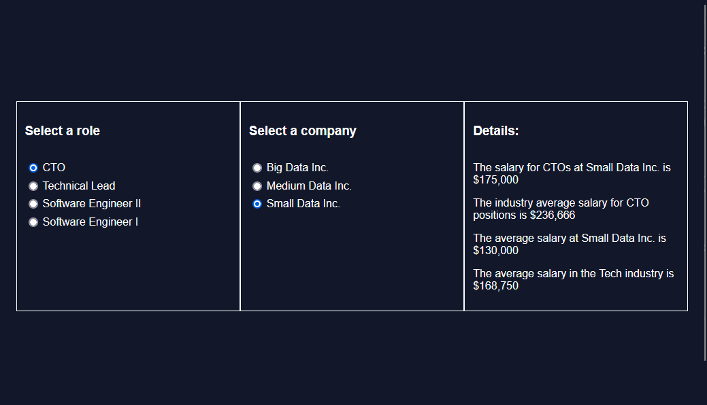

# WorkAround Explorer

A intermediate Javascript Project

## About

WorkAround Explorer is a web-app developed to help both recruiters and candidates to look up on info on current tech jobs salaries over different roles and companies.

### How it works

WorkAround Explorer is build on modules. The main.js renders information on the HTML as a result of calling functions defined in the modules over in the modules' folder.

* On salaryData, there's an array of data objects containing all the data on salaries, companies and positions. There are also helper functions to sort through the data
* On workAroundModule, there are functions that retrieve the data sent over from salaryData and manipulate it, bringing average values to the table.
* On utilities there is only one function that helps display the numbers in a more organised fashion.

All these functions are them called upon the main.js so it can execute it's job.

## Try it! 

Clik on this [link](https://prospektsmarch22.github.io/workAroundExplorer/) to try the web app
